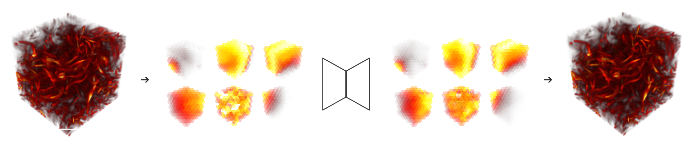

## Neural Volume Compression

Compressing 3D volumetric data with a blocked autoencoder approach. See `report.pdf` for an explanation.




### Basic Usage

```python
from codex import CodecDenseVAE
from utils import load_volume, show_volume

# default is the "more parameters" variant
codec = CodecDenseVAE()

# or load a custom model
codec = CodecDenseVAE(size=8, margin=0,
        model_pth="dense_vae_s8_m0_l32_h128_b64_e20.pt")

# encode and decode
vol = load_volume("data/tacc_turbulence_256x256x256_1x1x1_uint8.raw", size=256)
encoded = codec.encodes(vol)
decoded = codec.decodes(encoded)

# visualize
show_volume(decoded)
```

The model name `s8_m0_l32_h128_b64_e20` refers to 8-wide blocks, 0 margin, 32 latent dims, 128 hidden dims, batch size of 64 and 20 epochs.


### Project Structure

* `utils.py` Utilities for loading, saving, preprocessing, segmenting and visualizing volumes.
* `models.py` Pytorch neural models, such as DenseVAE.
* `codex.py` End-to-end codec classes, which wrap the NN models and include all pre/post processing.
* `dataset.py` Blocked dataset class used for training.
* `training.py` All utilities for training the NN models.
* `eval.py` Utilities for evaluating both raw models and end-to-end codecs.